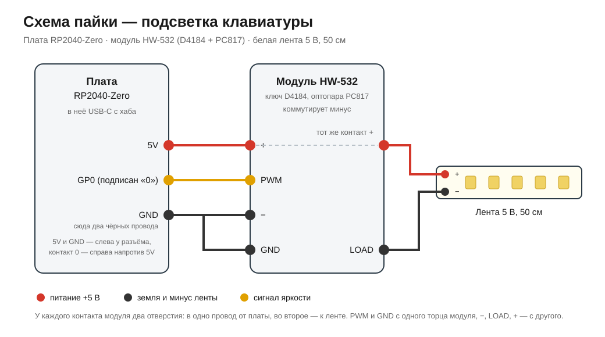

# desk-light — подсветка клавиатуры с управлением с компьютера

Светодиодная лента под монитором, которая включается горячими клавишами на ноутбуке:
удобно печатать в темноте. Собрано из платы RP2040-Zero, модуля-ключа и куска обычной
белой ленты 5 В. Отдельный блок питания не нужен — всё висит на одном USB.



## Как это работает

Приложение в трее держит COM-порт платы и шлёт ей короткие текстовые команды. Плата
крутит ШИМ на модуле-ключе, а тот пропускает ток на ленту. Один USB-кабель — это и
питание, и связь.

Если ноутбук сняли с подставки или приложение закрыли, плата гасит ленту сама: нет
команд дольше десяти секунд — свет выключается. Логика «хозяин ушёл» живёт на плате,
потому что хаб питается сам и лента иначе осталась бы гореть.

## Железо

| Что | Модель | Заметки |
|---|---|---|
| Плата | Waveshare RP2040-Zero | MicroPython, USB-C |
| Ключ | модуль HW-532 (D4184 + оптопара PC817) | коммутирует минус, вход ШИМ с `GP0` |
| Лента | белая, 5 В, около 50 см | примерно 0,3 А |
| Питание | тот же USB-кабель | отдельный блок не нужен |

Схема пайки и порядок сборки — [docs/WIRING.md](docs/WIRING.md).

## Прошивка платы

1. Зажать на плате кнопку `BOOT`, воткнуть USB — появится диск `RPI-RP2`.
2. Скопировать на него [MicroPython для RP2040-Zero](https://micropython.org/download/WAVESHARE_RP2040_ZERO/).
3. Залить прошивку (номер порта свой):

```
pip install mpremote
mpremote connect COM5 fs cp firmware/main.py :main.py
mpremote connect COM5 reset
```

## Приложение

| Клавиши | Что делают |
|---|---|
| `Ctrl+Alt+L` | включить или выключить |
| `Ctrl+Alt+PgUp` / `Ctrl+Alt+PgDn` | ярче или тусклее, 40 ступенек; клавишу можно держать зажатой |

Значок в трее: клик — вкл/выкл, в меню — быстрые уровни яркости. В Windows 11 новые
значки прячутся под стрелку «^», так что в первый раз ищи его там и закрепи.

Готовый `desk-light.exe` лежит в разделе Releases: один файл, Python не нужен.
Из исходников:

```
python -m venv .venv
.venv\Scripts\pip install pyserial pystray pillow
.venv\Scripts\pythonw app\tray.py
```

Автозапуск при входе в систему (ярлык в папке автозагрузки):

```
powershell -ExecutionPolicy Bypass -File scripts\autostart.ps1
powershell -ExecutionPolicy Bypass -File scripts\autostart.ps1 -Remove
```

## Что ещё в репозитории

- [docs/PROTOCOL.md](docs/PROTOCOL.md) — команды между приложением и платой.
- [app/cli.py](app/cli.py) — одна команда из консоли: `python app/cli.py set 300`.
- [app/selftest.py](app/selftest.py) — прогон железа: вспышки, ступеньки яркости, поиск
  порога оптопары.
- [docs/ROADMAP.md](docs/ROADMAP.md) и [docs/FINDINGS.md](docs/FINDINGS.md) — план и журнал находок.

Собрать exe самому: `.venv\Scripts\python -m PyInstaller --noconfirm --onefile --windowed
--name desk-light --hidden-import pystray._win32 --distpath dist --workpath build
--specpath build app\tray.py`
